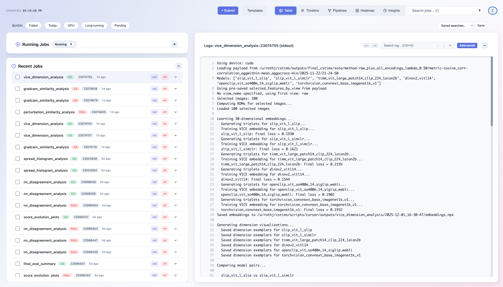
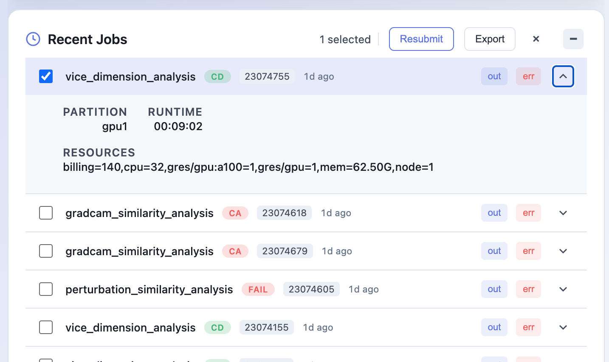
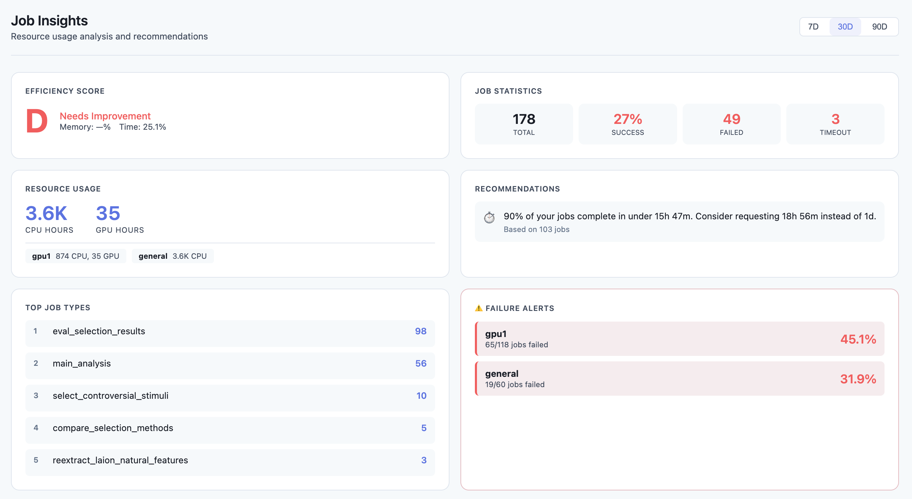
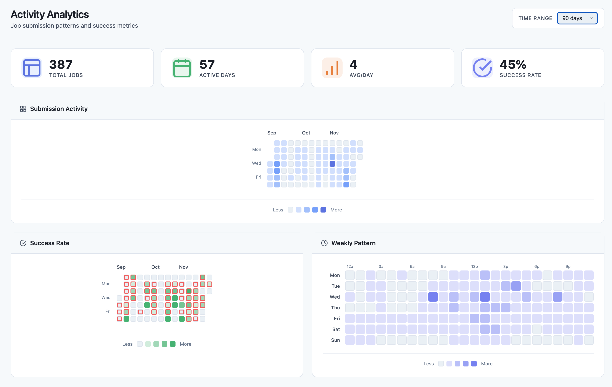

# Slurm Dashboard

A lightweight, real-time web dashboard for monitoring Slurm HPC cluster jobs. View logs, track resource usage, analyze job patterns, and manage your workloads from a clean, modern interface.



## Features

- **Real-time job monitoring** - Live log streaming with auto-refresh
- **Multiple views** - Table, Timeline, Pipeline DAG, Heatmap, and Insights
- **Job management** - Submit, cancel, and resubmit jobs with templates
- **Smart log analysis** - Automatic error detection and highlighting
- **Resource tracking** - CPU/GPU hours, memory efficiency, partition health
- **Analytics dashboard** - Job patterns, peak hours, failure analysis
- **Batch operations** - Select multiple jobs for cancel/resubmit/export
- **Dark mode** - Easy on the eyes during those late-night debugging sessions

## Screenshots

<table>
<tr>
<td width="50%">

**Job List & Logs**


</td>
<td width="50%">

**Insights Dashboard**


</td>
</tr>
<tr>
<td width="50%">

**Timeline View**


</td>
<td width="50%">

**Heatmap View**


</td>
</tr>
</table>

## Installation

```bash
pip install -e .
```

### Requirements

- Python 3.8+
- Access to Slurm commands (`squeue`, `sacct`, `scancel`, `sbatch`)
- A web browser

## Quick Start

```bash
# Basic usage - uses current user and default log location
slurm-dashboard

# Specify log directory
slurm-dashboard --log-root /path/to/your/logs

# Full options
slurm-dashboard --log-root ~/slurm-logs --user myusername --port 8080
```

Then open `http://localhost:5000` in your browser.

## Configuration

### Command Line Options

| Option | Default | Description |
|--------|---------|-------------|
| `--host` | `127.0.0.1` | Host to bind to |
| `--port` | `5000` | Port to bind to |
| `--log-root` | `~/slurm-logs` | Root directory for Slurm log files |
| `--log-pattern` | `{name}/job.{stream}.{id}` | Log file path pattern |
| `--user` | Current user | Slurm username to filter jobs |
| `--refresh-cache` | `20` | Cache refresh interval in seconds |

### Log File Patterns

The dashboard needs to know where your job logs are stored and how they're named. Use `--log-pattern` to match your cluster's configuration.

**Pattern variables:**
- `{name}` - Job name (from `--job-name` or script name)
- `{id}` - Slurm job ID
- `{stream}` - `out` for stdout, `err` for stderr

#### Common Cluster Configurations

**Default Slurm (flat directory):**
```bash
# Logs like: /home/user/slurm-12345.out, slurm-12345.err
slurm-dashboard --log-root ~ --log-pattern "slurm-{id}.{stream}"
```

**Subdirectory per job name (default):**
```bash
# Logs like: ~/slurm-logs/train_model/job.out.12345
slurm-dashboard --log-root ~/slurm-logs --log-pattern "{name}/job.{stream}.{id}"
```

**Nested by job ID:**
```bash
# Logs like: ~/logs/experiment/12345/stdout, ~/logs/experiment/12345/stderr
slurm-dashboard --log-root ~/logs --log-pattern "{name}/{id}/std{stream}"
```

**Project-based structure:**
```bash
# Logs like: /scratch/myproject/logs/job_12345.out
slurm-dashboard --log-root /scratch/myproject/logs --log-pattern "job_{id}.{stream}"
```

**Date-based directories (use wildcards in log-root):**
```bash
# For logs like: ~/logs/2024-01/train_12345.out
# Run from within the date directory or use a symlink
slurm-dashboard --log-root ~/logs/2024-01 --log-pattern "{name}_{id}.{stream}"
```

### Setting Up Your Slurm Scripts

To work with the dashboard, configure your Slurm scripts to write logs to a consistent location:

```bash
#!/bin/bash
#SBATCH --job-name=train_model
#SBATCH --output=/home/%u/slurm-logs/%x/job.out.%j
#SBATCH --error=/home/%u/slurm-logs/%x/job.err.%j

# Your job commands here
python train.py
```

**Slurm filename variables:**
- `%u` - Username
- `%x` - Job name
- `%j` - Job ID
- `%A` - Array job ID
- `%a` - Array task ID

### Array Jobs

For array jobs, you might want to include the array task ID:

```bash
#SBATCH --output=/home/%u/slurm-logs/%x/job.out.%A_%a
#SBATCH --error=/home/%u/slurm-logs/%x/job.err.%A_%a
```

Then use:
```bash
slurm-dashboard --log-pattern "{name}/job.{stream}.{id}"
# The dashboard handles array job IDs like 12345_0, 12345_1 automatically
```

## Running on a Cluster

### SSH Tunnel (Recommended)

If you're running the dashboard on a login node:

```bash
# On the cluster
slurm-dashboard --port 5000

# On your local machine (in another terminal)
ssh -L 5000:localhost:5000 user@cluster.example.com

# Then open http://localhost:5000 in your browser
```

### Binding to All Interfaces

To access from other machines on the same network (less secure):

```bash
slurm-dashboard --host 0.0.0.0 --port 5000
```

**Note:** Only do this on trusted networks. The dashboard can cancel and submit jobs.

### Running in Background

```bash
# Using nohup
nohup slurm-dashboard --log-root ~/slurm-logs > dashboard.log 2>&1 &

# Using screen
screen -S dashboard
slurm-dashboard --log-root ~/slurm-logs
# Ctrl+A, D to detach

# Using tmux
tmux new -s dashboard
slurm-dashboard --log-root ~/slurm-logs
# Ctrl+B, D to detach
```

## Views

### Table View (Default)
- Running jobs with real-time status
- Recent jobs with expandable details
- Click any job to view its logs
- Quick filters for state, partition, GPU usage

### Timeline View
- Gantt-style visualization of job history
- See job overlaps and gaps
- Filter by state or job name
- Zoom in/out for different time scales

### Pipeline View
- DAG visualization of job dependencies
- Track pipeline progress
- See which jobs are blocking others

### Heatmap View
- GitHub-style activity calendar
- Hourly submission patterns
- Success/failure rate visualization

### Insights View
- Efficiency score (A-F grade)
- Resource usage metrics (CPU/GPU hours)
- Memory and time limit recommendations
- Failure pattern detection
- Peak hours analysis
- Top job types

## Troubleshooting

### "No recent logs found"
- Check that `--log-root` points to the correct directory
- Verify `--log-pattern` matches your log file naming
- Ensure log files exist and are readable

### "sacct: command not found"
- The dashboard requires Slurm commands to be in your PATH
- Make sure you're running on a node with Slurm client tools installed

### Jobs not showing up
- Check that `--user` matches the username used when submitting jobs
- Verify jobs are in sacct history: `sacct -u $USER --starttime=now-7days`

### Log streaming not working
- Ensure the log files are accessible from the node running the dashboard
- Check file permissions on the log directory

## Development

```bash
# Install in development mode
pip install -e ".[dev]"

# Run with debug mode
FLASK_DEBUG=1 slurm-dashboard

# Run tests
pytest
```

## License

MIT
